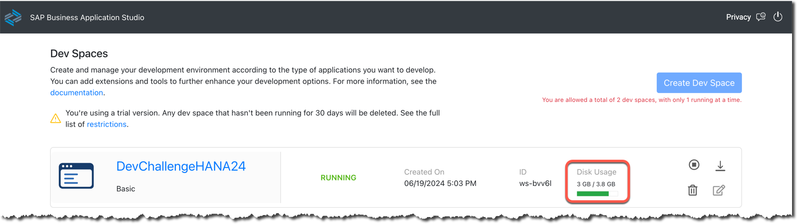
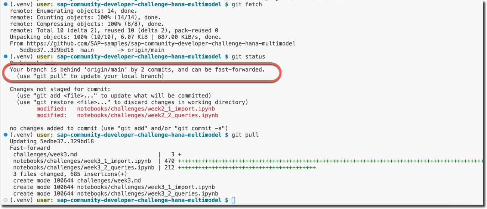
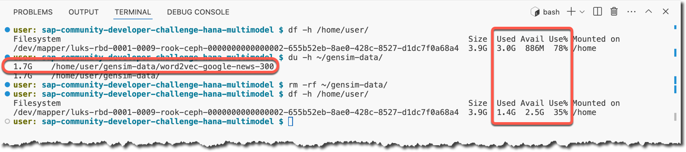
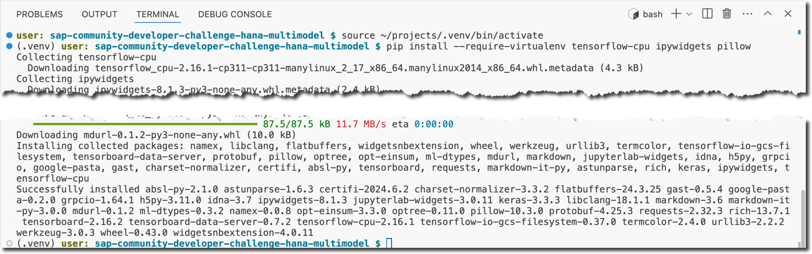
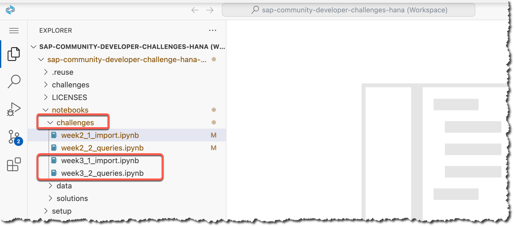

## Week 3 Challenge: Image Embeddings in the SAP HANA database

During this week 3 of the June 2024 challenge, you are going to use the [Vector Engine of the SAP HANA database](https://community.sap.com/t5/technology-blogs-by-sap/sap-hana-cloud-vector-engine-quick-faq-reference/ba-p/13675212) in the SAP HANA Cloud to load, store and process embeddings: images represented as vectors.

In this exercise, you will use embeddings created using the pre-trained ML model [ResNet-50](https://en.wikipedia.org/wiki/Residual_neural_network).

[You said the previous weeks' challenges were too simple](https://community.sap.com/t5/application-development-discussions/submissions-for-quot-sap-hana-cloud-multi-model-quot-developer-challenge/m-p/13729352/highlight/true#M2028484), so to make it more challenging this week you will experience different typos and errors in the provided Jupyter notebooks. You need to fix them and run both notebooks to the end successfuly.

### Let's go!

1. Check that your instance of the SAP HANA database in the SAP Business Technology Platform is running.


2. Start (if needed) and open the dev space in the SAP Business Application Studio that you set up earlier.

Note the disk usage of the dev space `DevChallengeHANA24`. You downloaded quite big (~1.7GB) Google News Word2vec model during the Week 2's challenge.



3. Get the week 3 notebooks `week3_*.ipynb` from the repository's [notebooks/challenges/](https://github.com/SAP-samples/sap-community-developer-challenge-hana-multimodel/tree/main/notebooks/challenges) directory.

You can use the Git extension in the SAP Business Aplication Studio (BAS), or Git commands in the terminal:

```shell
cd ~/projects/sap-community-developer-challenge-hana-multimodel

git fetch
git status
git pull
```



4. Open the workspace file from the cloned project.

5. Make sure that `HANAwPy` profile is open.

6. Check the free space available in your dev space. Free up the space used by the week 2's model.

```shell
df -h /home/user/
du -h ~/gensim-data/
rm -rf ~/gensim-data/
df -h /home/user/
```



7. Install the [TensorFlow](https://en.wikipedia.org/wiki/TensorFlow) package into your virtual environment.

In the Terminal session activate the Python's virtual environment `.venv` set during the [setup exercise](../setup/setup.md).

```shell
source ~/projects/.venv/bin/activate
```

Install the [`tensorflow-cpu` package](https://pypi.org/project/tensorflow-cpu/). The CPU-only TensorFlow package is much smaller, but is sufficient for your exercise. You will use this package to get embeddings (vector representations) for images.

Install [Interactive HTML Widgets `ipywidgets`](https://pypi.org/project/ipywidgets/) and [Python Imaging Library (Fork) `pillow`](https://pypi.org/project/pillow/) packages that will be required in processing and displaying images.

```shell
pip install --require-virtualenv tensorflow-cpu ipywidgets pillow
```



8. Open and execute `week3*` notebooks from the `challenges` sub-folder in `notebooks`.

Note that `solutions` subfolder does not contain `week3*` notebooks with correct code until June 26th, 2024 🤓 when the Week 4 challenge will be released.



The kernel for the notebook should be automatically set to **`.venv`**, thanks to the settings in the workspace file [`sap-community-developer-challenges-hana.code-workspace`](../sap-community-developer-challenges-hana.code-workspace).


> [!IMPORTANT] 
> Make sure that you read the comments explaining what is happening, and ask your questions in https://community.sap.com/t5/application-development-discussions/questions-re-quot-multi-model-with-sap-hana-cloud-quot-developer-challenge/m-p/13721632#M2028349, if needed.

8. At the end of the notebook `week3_2_queries.ipynb`, in the last section, experiment with different randomly generated records to find the pair of pets 🐱🐶 to share as a screenshot as your submission for week 3: https://community.sap.com/t5/application-development-discussions/submissions-for-quot-sap-hana-cloud-multi-model-quot-developer-challenge/m-p/13736471

There are some suggestions for additional challenges at the end of the `week3_2_queries.ipynb` notebook.