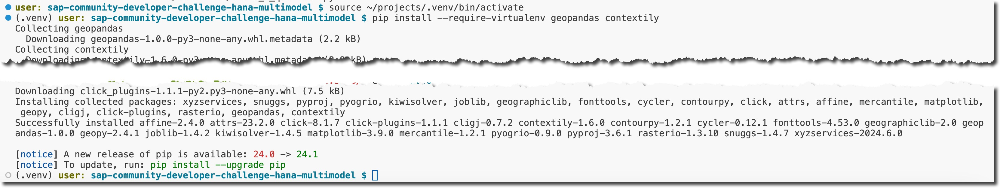
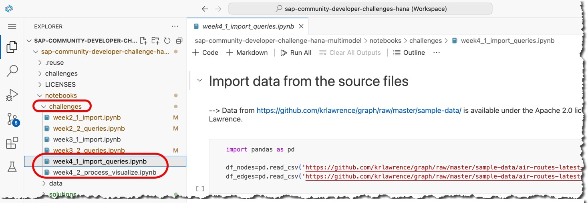

## Week 4 Challenge: Geospatial and Graph

During this week 4 of the June 2024 challenge, you are going to use the multi-model capabilities of SAP HANA Cloud: the Geospatial data and Graph artifacts.

Similar to the previous week, this week you will experience different typos and errors in the provided Jupyter notebooks. You need to fix them and run both notebooks to the end successfuly.

### Let's go!

1. Check that your instance of the SAP HANA database in the SAP Business Technology Platform is running.


2. Start (if needed) and open the dev space in the SAP Business Application Studio that you set up earlier.

3. Get the week 4 notebooks `week4_*.ipynb` from the repository's [notebooks/challenges/](https://github.com/SAP-samples/sap-community-developer-challenge-hana-multimodel/tree/main/notebooks/challenges) directory into your project in the BAS dev space.

You can use the Git extension in the SAP Business Aplication Studio (BAS), or Git commands in the terminal:

```shell
cd ~/projects/sap-community-developer-challenge-hana-multimodel

git fetch
git status
git pull
```

4. Open the workspace file from the cloned project.

5. Make sure that Business Application Studio's `HANAwPy` profile is set.

6. Install the [Geopandas](https://geopandas.org/en/stable/about.html) and [contextily](https://contextily.readthedocs.io/en/latest/) open-source packages into your virtual environment.

In the Terminal session activate the Python's virtual environment `.venv` set during the [setup exercise](../setup/setup.md).

```shell
source ~/projects/.venv/bin/activate
```

Install the packages.

```shell
pip install --require-virtualenv geopandas contextily
```



7. Open and execute `week4*` notebooks from the `challenges` sub-folder in `notebooks`.

Note that the `solutions` subfolder will not contain `week4*` notebooks with the correct code before June 26th, 2024 🤓, when the challenge is over.



The kernel for the notebook should be automatically set to **`.venv`**, thanks to the settings in the workspace file [`sap-community-developer-challenges-hana.code-workspace`](../sap-community-developer-challenges-hana.code-workspace).


> [!IMPORTANT] 
> Make sure that you read the comments explaining what is happening, and ask your questions in https://community.sap.com/t5/application-development-discussions/questions-re-quot-multi-model-with-sap-hana-cloud-quot-developer-challenge/m-p/13721632#M2028349, if needed.

8. At the end of the notebook `week4_2_process_visualize.ipynb`, in the last section, experiment with different values of airport codes of the first and the last airport to share a map with the route and intermediate cities as a screenshot as your submission for week 4: https://community.sap.com/t5/application-development-discussions/submissions-for-quot-sap-hana-cloud-multi-model-quot-developer-challenge/td-p/13743532